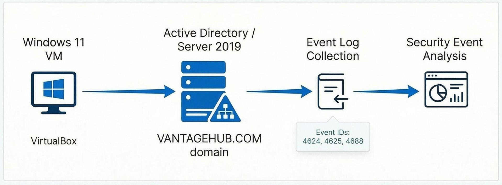

# Windows Security Monitoring Lab (Authentication and Process Telemetry)
This lab validates the foundational telemetry required for building authentication and execution-based detections in a SOC environment.

  

  <em>
    Windows security monitoring lab showing endpoint authentication and process telemetry flowing into security analysis.
  </em>

## Overview
This project demonstrates how to configure Windows audit policies, generate security events, and validate logs commonly used in SOC and blue-team environments.

The lab focuses on authentication monitoring and process execution visibility, with evidence captured directly from the Windows Security Event Log.

## What This Lab Demonstrates
- Configuring Advanced Audit Policy settings to generate security telemetry
- Generating and validating authentication events (successful and failed logons)
- Capturing process creation events with command-line arguments
- Mapping Windows security events to MITRE ATT&CK techniques
- Producing portfolio-ready evidence via screenshots

## Environment
- Hypervisor: VirtualBox
- OS: Windows 11 (Evaluation ISO)
- Log Source: Windows Security Event Log
- Validation: Event Viewer

## Audit Policies Enabled
Enable the following Advanced Audit Policies:

1. Logon/Logoff
   - Audit Logon: Success and Failure

2. Account Logon
   - Audit Credential Validation: Success and Failure

3. Detailed Tracking
   - Audit Process Creation: Success

Also enable command-line capture for process creation events:
- Computer Configuration -> Administrative Templates -> System -> Audit Process Creation
  - Include command line in process creation events: Enabled

## Lab Steps

### 1) Create the VM
1. Install VirtualBox
2. Download and install a Windows 11 ISO in a new VM
3. Boot the VM and complete Windows setup

### 2) Enable Audit Policies
1. In the Windows VM, open Local Security Policy (search in Start)
2. Go to:
   - Advanced Audit Policy Configuration -> Audit Policies
3. Turn on:
   - Logon/Logoff -> Audit Logon -> Success + Failure
   - Account Logon -> Audit Credential Validation -> Success + Failure
   - Detailed Tracking -> Audit Process Creation -> Success

### 3) Generate Logs
Perform the following actions inside the VM:
- Log out and log back in once
- Type the wrong password 2–3 times
- Open:
  - Notepad
  - Calculator
  - Command Prompt

### 4) Validate Events in Event Viewer
1. Open Event Viewer
2. Navigate to:
   - Windows Logs -> Security
3. Filter by these Event IDs:
   - 4624 (Successful Logon)
   - 4625 (Failed Logon)
   - 4688 (Process Creation)

## Evidence (Screenshots)
Screenshots are stored in the `screenshots/` folder.

Recommended filenames:
- `screenshots/4624-successful-logon.png`
- `screenshots/4625-failed-logon.png`
- `screenshots/4688-process-creation.png`

Each screenshot should clearly show:
- Event ID
- Timestamp
- Hostname
- Key fields relevant to the event (account, source IP, process/command line, etc.)

## Event Reference

### Event ID 4624 - Successful Logon
Purpose:
- Confirms valid authentication activity

Fields to review:
- Logon Type
- Account Name
- Workstation Name
- Source Network Address

### Event ID 4625 - Failed Logon
Purpose:
- Captures failed authentication attempts (wrong password, lockout, etc.)
- Useful for brute force detection patterns

Fields to review:
- Failure Reason / Status / SubStatus
- Account Name
- Workstation Name
- Source Network Address

### Event ID 4688 - Process Creation
Purpose:
- Captures process execution telemetry
- Useful for analyzing execution patterns and suspicious commands

Fields to review:
- New Process Name
- Command Line
- Parent Process Name
- Subject (user context)

## MITRE ATT&CK Mapping
This lab aligns Windows security events to MITRE ATT&CK techniques to show how endpoint telemetry maps to common adversary behaviors.

| Event ID | MITRE Technique | Technique Name | How It Relates |
|---------:|------------------|----------------|----------------|
| 4624 | T1078 | Valid Accounts | Successful authentication using legitimate credentials |
| 4625 | T1110 | Brute Force | Failed authentication attempts that may indicate brute force or password spraying |
| 4688 | T1059 | Command-Line Interface | Process execution telemetry that can include CLI tools and suspicious commands |

## Example Detection Ideas
- Alert on multiple 4625 events from the same source within a short time window (possible brute force)
- Identify 4625 bursts followed by a 4624 success for the same account (possible credential compromise)
- Monitor 4688 events for suspicious command-line usage or unusual parent-child relationships

## Next Steps
- Forward logs to a SIEM (Elastic/Splunk) for centralized visibility
- Build correlation rules and detection logic based on the above events
- Expand to additional endpoints and implement Windows Event Forwarding (WEF)

## Lab Status
Complete
